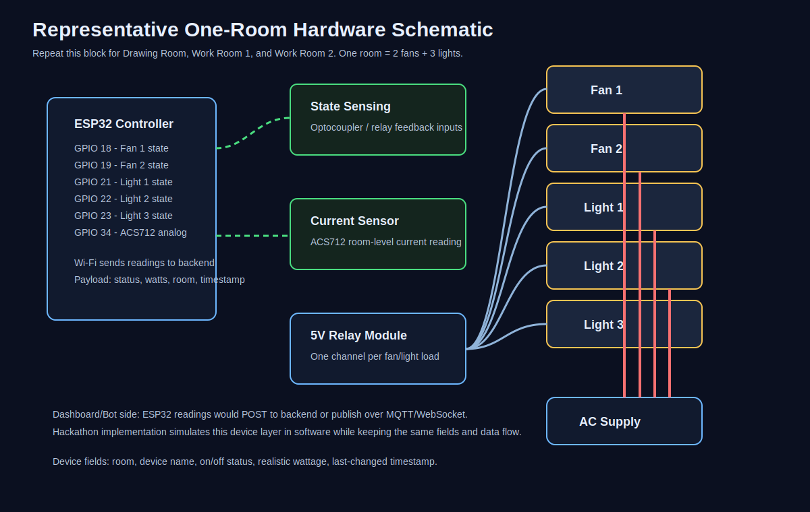

# Office Power Monitor

Real-time office power monitoring for a small workplace. The project combines a
React dashboard, a Node.js backend, an alert engine, persistent storage, AI
answers, and a Discord bot for command-based access.

## A High-Level System Diagram


## Hardware / Electrical Schematic

The representative one-room circuit is included in
[`hardware/`](./hardware/README.md). It shows an ESP32 reading 2 fan states,
3 light states, and a room-level current sensor. The same circuit is repeated
for all three rooms.



## What This Project Does

- Tracks 15 simulated devices across three rooms.
- Streams device, power usage, and alert updates in real time.
- Detects after-hours usage and sustained high-load rooms.
- Persists state with SQLite, with JSON fallback support.
- Exposes REST APIs for dashboards, analytics, alerts, and AI questions.
- Provides a Discord bot with live commands and critical alert push messages.
- Supports AI providers including OpenAI, Gemini, DeepSeek, and Ollama.
- Includes required system and hardware diagrams in the repository.

## Project Layout

| Path | Purpose |
| --- | --- |
| `src/` | React + Vite frontend dashboard |
| `server/` | Express API, Socket.IO, storage, simulator, alerts, and AI service |
| `bot/` | Standalone Discord bot that talks to the backend over REST and Socket.IO |
| `hardware/` | Representative ESP32/Wokwi-style one-room circuit schematic |
| `guidelines/` | Project notes and implementation guidelines |

The server also contains an in-process Discord bot under `server/src/bot/`.
Use either the standalone `bot/` project or the server bot mode, not both with
the same Discord token.

## Quick Start

### 1. Start The Backend

```bash
cd server
npm install
copy .env.example .env
npm run dev
```

The backend starts at `http://localhost:3001` by default.

### 2. Start The Frontend

From the project root:

```bash
npm install
copy .env.example .env
npm run dev
```

The dashboard is served by Vite, usually at `http://localhost:5173`.

### 3. Start The Discord Bot

In a separate terminal:

```bash
cd bot
npm install
copy .env.example .env
npm run dev
```

The backend must be running before the bot starts. Fill in the Discord token,
client ID, channel ID, and API URL in `bot/.env`.

On macOS or Linux, use `cp .env.example .env` instead of `copy`.

## Discord Commands

| Command | Aliases | Description |
| --- | --- | --- |
| `!status` | `!s`, `!devices`, `!all` | Show all rooms and live device wattage |
| `!room <name>` | `!r` | Show detailed status for one room |
| `!usage` | `!u`, `!power`, `!watts` | Show live watts, today's estimated kWh, and per-room usage |
| `!alerts` | `!a`, `!warn`, `!warnings` | Show active alerts |
| `!ask <question>` | `!ai`, `!q`, `!query` | Ask the AI assistant about the live office state |
| `!help` | `!h`, `!?`, `!commands` | Show the command list |

Example questions:

```text
!ask what rooms are consuming the most power?
!ask is anything unusual happening?
!ask summarize the office status
```

## Backend API Overview

| Area | Example Paths |
| --- | --- |
| Devices | `GET /devices`, `PATCH /devices/:id`, `POST /devices/:id/toggle` |
| Rooms | `GET /rooms`, `GET /rooms/:name` |
| Usage | `GET /usage`, `GET /usage/total`, `GET /usage/rooms` |
| Alerts | `GET /alerts`, `GET /alerts/history`, `DELETE /alerts/:id` |
| AI | `POST /ai/ask`, `GET /ai/context` |
| Demo Mode | `GET /demo`, `POST /demo/set`, `DELETE /demo` |
| Meta | `GET /health`, `GET /simulator` |

Real-time events are available through the Socket.IO `/monitor` namespace.

## Environment Files

Each runtime has its own example file:

| Project | Example File | Notes |
| --- | --- | --- |
| Frontend | `.env.example` | Backend API base URL for the dashboard |
| Backend | `server/.env.example` | API port, storage, MongoDB, AI providers, office rules |
| Discord bot | `bot/.env.example` | Discord credentials and backend URL |

Do not commit real `.env` files. They contain local secrets and are ignored by
Git.

## Main Scripts

### Frontend

```bash
npm run dev
npm run build
```

### Backend

```bash
cd server
npm run dev
npm run build
npm start
```

### Discord Bot

```bash
cd bot
npm run dev
npm run build
npm start
```

## Notes For Development

- Run only one Discord bot process for a given token.
- If every Discord command replies twice, stop all bot/server processes and
  start only the bot mode you intend to use.
- Active Discord alert reminders repeat every 5 minutes by default. Change
  `DISCORD_ALERT_REPEAT_INTERVAL_MS` in the bot env file, or set it to `0` to disable repeats.
- SQLite/JSON state files, build output, lock files, logs, and local
  environment files are treated as local runtime artifacts.
- More detailed backend and bot documentation is available in
  `server/README.md` and `bot/README.md`.
